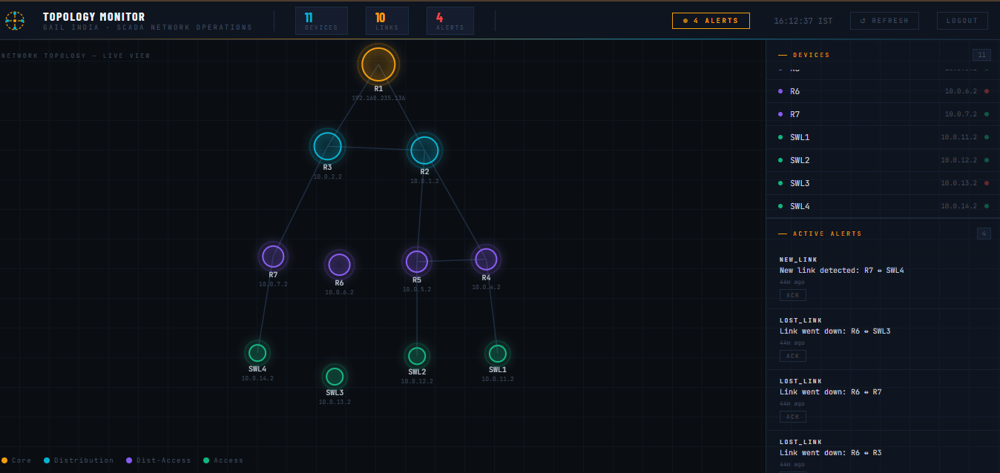
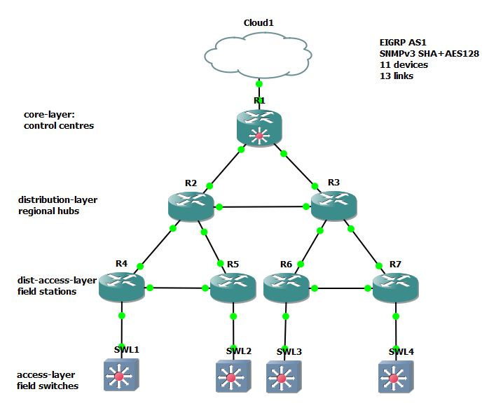

# GAIL SCADA — Network Topology Discovery Tool

> Secure automatic network topology discovery for industrial pipeline SCADA networks.
> Built for Smart India Hackathon 2024 — Problem Statement by GAIL (India) Limited.

---

## Overview





Traditional network topology tools rely on CDP/LLDP protocols which are disabled in secure SCADA environments. This tool discovers and monitors network topology **without CDP/LLDP** using:

- **SNMPv3** with SHA authentication and AES128/DES encryption
- **EIGRP neighbour tables** for confirmed live link discovery
- **ARP table cross-referencing** for device adjacency mapping
- **Real-time change detection** with typed security alerts

Any new device appearing on the network triggers an immediate **CRITICAL** alert — making rogue device detection automatic.

---

## Architecture

```
GNS3 Network (11 devices, SNMPv3)
        ↓
[ collector/ ]  — SNMPv3 queries, ARP tables, EIGRP neighbours
        ↓
[ graph/ ]      — NetworkX graph, SQLite storage, alert engine
        ↓
[ api/ ]        — FastAPI REST API, JWT authentication
        ↓
[ dashboard/ ]  — D3.js topology visualisation, live alerts
```

### Tech Stack

| Layer | Technology |
|---|---|
| Network Collection | Python, pysnmp 4.4.12 |
| Graph Analysis | NetworkX |
| Database | SQLite, SQLAlchemy |
| API | FastAPI, JWT (python-jose) |
| Dashboard | HTML, D3.js v7 |
| Simulation | GNS3, Cisco IOS (c7200, c3745) |

---

## Network Topology

11-device three-tier hierarchical pipeline network:

```
                    R1 (Core — Control Centre)
                   /    \
                 R2 ----- R3          ← Distribution (Regional Hubs)
               /  \      /  \
             R4----R5   R6---R7       ← Dist-Access (Field Stations)
             |     |    |    |
           SWL1   SWL2 SWL3 SWL4     ← Access (Field Switches)
```

| Device | Role | Model | Tier |
|---|---|---|---|
| R1 | Control Centre Core | c7200 | Core |
| R2, R3 | Regional Hubs (North/South) | c7200 | Distribution |
| R4–R7 | Compressor/Metering Stations | c3745 | Dist-Access |
| SWL1–SWL4 | Field Switch Panels | c3745 NM-16ESW | Access |

**Routing:** EIGRP AS1 across all devices
**Security:** SNMPv3 SHA authentication + AES128 encryption (c7200) / DES encryption (c3745)

---

## Features

- **Automatic Discovery** — discovers all devices and links without manual input
- **No CDP/LLDP** — works in secure environments where these protocols are disabled
- **Rogue Device Detection** — any unknown device triggers CRITICAL alert immediately
- **Link Failure Detection** — lost links generate HIGH severity alerts within one poll cycle
- **Graph Analysis** — BFS traversal, Dijkstra shortest path, articulation points, bridges, centrality
- **Historical Storage** — every snapshot stored in SQLite with full timestamp history
- **Secure API** — JWT-authenticated REST API, all endpoints protected
- **Professional Dashboard** — D3.js interactive topology map with live alerts and device status

---

## Setup

### Prerequisites

- Python 3.10+
- GNS3 with c7200 and c3745 IOS images
- VMware (for GNS3 VM)

### Installation

```bash
git clone https://github.com/sneha-trivedii/SCADA-Network-Topology-Discovery-Tool
cd SCADA-Network-Topology-Discovery-Tool

python -m venv venv
venv\Scripts\activate          # Windows
source venv/bin/activate       # Linux/Mac

pip install -r requirements.txt
```

### Configuration

Edit `config/settings.py`:

- Set device IPs to match your network
- Set SNMPv3 credentials (`SNMP_CONFIG`)
- Adjust `COLLECTOR_INTERVAL_SECONDS` as needed (default: 60)

### Running

**Terminal 1 — Start API:**

```bash
uvicorn api.main:app --reload --host 0.0.0.0 --port 8000
```

**Terminal 2 — Run continuous monitoring:**

```bash
python -m collector.change_detector continuous
```

**Open dashboard:**

```
http://localhost:8000/login
```

Default credentials: `admin` / `gail2024`

---

## API Endpoints

| Method | Endpoint | Description |
|---|---|---|
| POST | `/auth/login` | Get JWT token |
| GET | `/api/topology` | Full topology (devices + links) |
| GET | `/api/devices` | Device list |
| GET | `/api/connections` | Connection list |
| GET | `/api/alerts` | Alerts with optional filters |
| POST | `/api/alerts/{id}/ack` | Acknowledge an alert |
| GET | `/api/analysis` | Graph analysis results |
| GET | `/api/path?source=X&target=Y` | Shortest path between two devices |
| GET | `/api/health` | Network health summary |

All endpoints except `/auth/login` require `Authorization: Bearer <token>` header.

Interactive API documentation available at `http://localhost:8000/docs`.

---

## Project Structure

```
SCADA-Network-Topology-Discovery-Tool/
├── collector/
│   ├── snmp_client.py        # SNMPv3 get/walk functions
│   ├── device_info.py        # Device info via SNMP MIB-II
│   ├── arp_reader.py         # ARP table reader
│   ├── eigrp_reader.py       # EIGRP neighbour reader (Cisco MIB)
│   ├── change_detector.py    # Snapshot comparison, alert generation
│   └── topology_output.py    # Produces topology.json
├── graph/
│   ├── builder.py            # NetworkX graph builder
│   ├── analyzer.py           # BFS, Dijkstra, articulation points, bridges
│   ├── database.py           # SQLite storage via SQLAlchemy
│   ├── alert_engine.py       # Alert deduplication and management
│   └── pipeline.py           # Full pipeline orchestrator
├── api/
│   └── main.py               # FastAPI app, JWT auth, all endpoints
├── dashboard/
│   ├── login.html            # Operator login page
│   └── index.html            # D3.js topology dashboard
├── config/
│   └── settings.py           # All configuration (IPs, credentials, intervals)
├── docs/
|   └── gns3-topology.png     # Actual GNS3 topology
|   └── dashboard.png         # Snapshot of the dashboard
├── data/                     # Runtime data (gitignored)
│   ├── topology.json         # Live topology snapshot
│   └── topology.db           # SQLite database
└── requirements.txt
```

---

## Security Design

- **SNMPv3** — all network queries encrypted and authenticated, no plaintext traffic
- **No CDP/LLDP** — passive discovery only, no broadcast protocols required
- **JWT Authentication** — all API endpoints protected with expiring tokens
- **Rogue Detection** — any device not in known inventory triggers CRITICAL alert
- **Audit Trail** — all topology snapshots and alerts stored with timestamps in SQLite

---

## Graph Analysis

The tool runs the following algorithms on every discovered topology:

| Algorithm | Purpose |
|---|---|
| BFS from core | Confirms network hierarchy, finds hop count to each device |
| Dijkstra shortest path | Finds lowest-latency path between any two devices using srtt_ms weights |
| Articulation points | Identifies single points of failure — devices whose removal splits the network |
| Bridge detection | Identifies links with no redundant backup path |
| Degree centrality | Ranks devices by connectivity importance |

---

## Demo Scenarios

**1. Normal Operation**
Run pipeline → dashboard shows HEALTHY, all 11 devices, 13 links visible in hierarchy.

**2. Link Failure**
Shut down any router in GNS3 → change detector detects lost links within 60 seconds → dashboard shows LOST_LINK alerts with affected device pairs.

**3. Rogue Device Detection**
Connect unknown device to network → configure minimal SNMP → NEW_DEVICE CRITICAL alert appears on next poll → operator acknowledges and investigates.

---

## Built With

- [pysnmp](https://pysnmp.readthedocs.io/) — SNMPv3 protocol implementation
- [NetworkX](https://networkx.org/) — Graph analysis algorithms
- [FastAPI](https://fastapi.tiangolo.com/) — REST API framework
- [SQLAlchemy](https://www.sqlalchemy.org/) — Database ORM
- [D3.js](https://d3js.org/) — Network topology visualisation
- [GNS3](https://www.gns3.com/) — Network simulation

---

## Author

Sneha Trivedi 
Problem Statement: Secure Automatic Network Topology Discovery — GAIL (India) Limited
GitHub: [sneha-trivedii/SCADA-Network-Topology-Discovery-Tool](https://github.com/sneha-trivedii/SCADA-Network-Topology-Discovery-Tool)